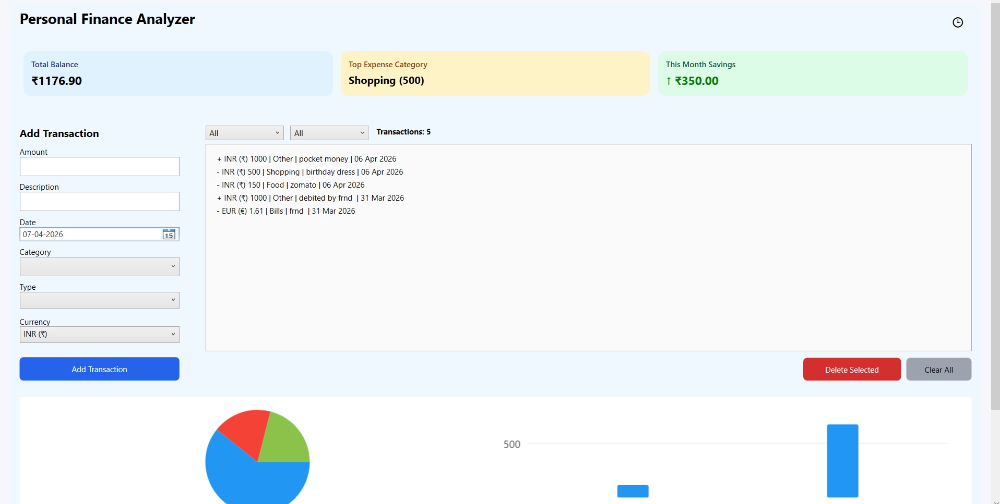
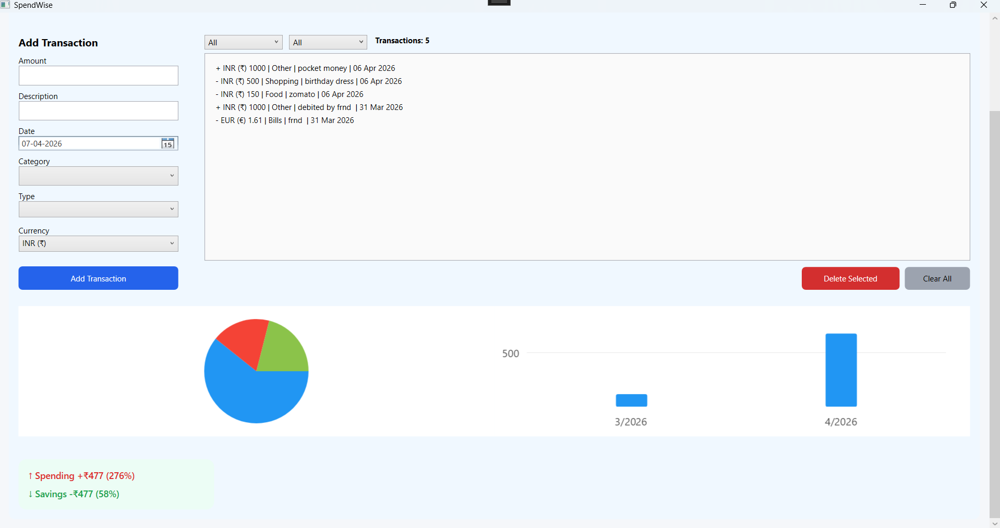

# SpendWise – Personal Finance Analytics Desktop App

## Overview

SpendWise is a desktop-based **Personal finance analytics application** built using WPF and C#.
It helps users track income and expenses while providing **insights, visual analytics, structured financial history**.

## Problem

Most people track daily expenses mentally or in temporary notes.
Once cleared or forgotten, there is **no reliable monthly history**, making it hard to:

- Review past spending  
- Compare income vs expenses  
- Difficulty analyzing spending patterns  
- Maintain financial discipline  

## Solution

**SpendWise** is a **desktop-first personal finance tracker** that separates  
**active session calculations** from **permanent financial history**.

It allows users to:
- Track income and expenses in real time  
- Persist transactions safely for long-term monthly analysis  
- View clean, structured financial history without cluttering the main UI  
- Analyze spending patterns through charts and insights

## Core Concept

SpendWise follows a **two-layer financial model**:

### 1. Session Layer (Calculator View)
- Temporary working list
- Can be cleared without losing history
- Optimized for daily usage

### 2. Ledger Layer (History View)
- Permanent transaction storage
- Month-wise income & expense breakdown
- Independent from UI clearing actions

## Features

### Transaction Management
- Add income and expense transactions
- Category-based tracking
- Support for multiple currencies
- Real-time balance calculation

### Analytics & Insights
- Top expense category detection
- Monthly spending comparison
- Savings increase/decrease tracking

### Data Visualization
- Expense distribution by category (Pie Chart)
- Monthly expense trends (Chart)

### History System
- Dedicated **History screen**
- Month-wise transaction grouping
- Separate Income & Expense views
- Monthly totals and net balance
- Safe deletion without affecting other months

### Data Persistence
- Local JSON-based ledger storage
- Session reset does not affect stored history
- Reloads automatically on app restart

### Clean UX
- Minimal desktop UI
- Dashboard-style summary cards (Balance, Category, Savings)
- History accessible via single icon (🕒)
- No clutter in main screen

## Tech Stack

- C#
- WPF (Windows Presentation Foundation)
- .NET
- LiveCharts (for data visualization)
- Local data persistence using JSON (System.Text.Json)

## Design Decisions

- **Desktop-first UI**  
  Chosen for clarity, keyboard efficiency, and system-level reliability.

- **Session vs Ledger separation**  
  Prevents accidental data loss while keeping UI lightweight.

- **Local-first storage**  
  No cloud dependency, faster access, full user privacy.

## Edge Cases Handled

- Clearing active transactions without deleting history
- Multiple currencies in the same month
- Deleting individual transactions safely
- Removing entire monthly records
- App restart without data loss

## Folder Structure

SpendWise/
├── MainWindow.xaml
├── HistoryWindow.xaml
├── Transaction.cs
├── TransactionStorage.cs
├── InsightService.cs  
├── App.xaml
├── README.md

## Future Improvements

- Budget tracking & alerts
- Advanced analytics
- Cloud sync

## Screenshots

## QA Testing Documentation

This project includes complete manual testing performed on the SpendWise application.

### Test Design

* Requirements
* Test Scenarios
* Bug Reports

(Stored in Excel file: Test-design.xlsx inside QA-Testing folder)

###  Test Execution

* Test Cases
* Test Coverage Report
* Test Summary Report

(Stored in Markdown files under Test-Execution folder)

###  Testing Scope

The application was tested for:

* Expense and income management
* Data validation and input handling
* Business logic correctness
* Data consistency and calculations
* Filtering and analysis features

### ✅ Outcome

All major functionalities were tested successfully. Identified defects were fixed and retested. The application is stable and meets expected requirements.
